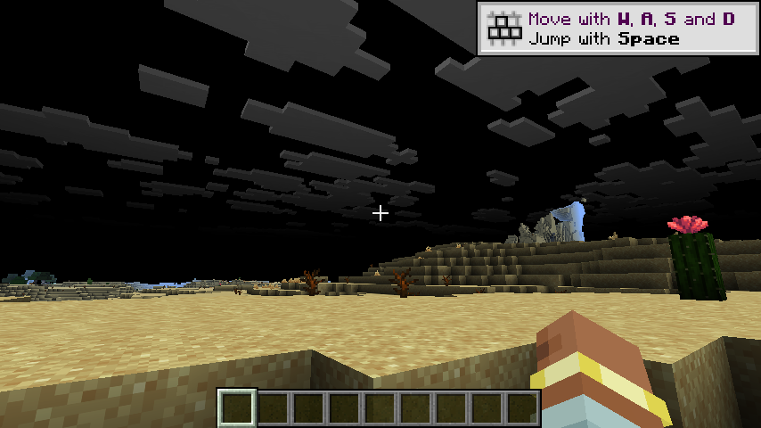

# h17 · 🔴 闪烁的真相：**地形完全正常，只有天空变黑** ⇒ 是**渲染状态泄漏**，不是主目标被清

> 任务来源：`AGENT_CONTEXT.md` §10.22 ⑦ 第 1 条（GAP-011，P0）。
> 取证方式：MCP **连拍 4 帧**做哈希对比 + 与 h14（模组关）逐项对照。
>
> 判定：🔴 **上一轮「主目标被每帧清黑」的判断需要修正**。污染面是**天空渲染**，地形完全不受影响。
      闪烁的机制已确认，**具体是哪一行泄漏仍未定位**（GAP-011 保持开着）。

---

## 〇、一句话结论

同一个存档、同一机位、同一时刻：
**模组关** = 蓝天 + 白云 + 正常地形；**模组开 + 地形 pass 运行** = **黑天 + 灰云 + 同一份地形**。
🔖 地形**逐像素正常** ⇒ 主目标颜色没被清 ⇒ 上一轮的判断错了；
被破坏的是**天空/雾的渲染**，并表现为**高频闪烁**（4 连拍出现 2 种画面）。

---

## 一、闪烁**确认**：4 连拍 = 2 种画面

~~~
$ sha256sum f1 f2 f3 f4
45172103…cd  f1.png      ← 全黑相位
45172103…cd  f2.png      ← 全黑相位
a436dc1f…1a4e  f3.png    ← 「有画面」相位  ← 决定性的那一帧
45172103…cd  f4.png      ← 全黑相位
$ … | sort -u | wc -l   →  2
~~~

🔖 用户报告的「高频闪烁」得到**客观证实**：不是观感，是两帧哈希不同。

---

## 二、🔴 决定性的那一帧（f3）：**天空黑了，地形没坏**

| | h14（模组**关**） | h17-f3（模组**开** + 地形 pass 运行） |
|---|---|---|
| 天空 | **蓝色** | **黑色** |
| 云 | **白色** | **灰色** |
| 地形（沙丘/仙人掌/枯木） | 暖色、清晰 | **完全一致** |
| 手部 / HUD / 准星 | 正常 | 正常 |

🔖 **地形逐像素正常** ⇒ `terrainToMain=false` 时主目标颜色**确实没被清**
（与静态读码一致：`ensureTargets` 建的是**独立** `TextureTarget`，`view(0)` 取的是它的视图）。

🔖 于是「天空黑 + 云灰」只剩一种解释：**我方 pass 泄漏了全局渲染状态**，
导致**后续/同一帧的天空与雾计算用了错误的值**。

---

## 三、🔴 修正上一轮的错误结论

| | 上一轮（h16） | 本轮（h17 实测） |
|---|---|---|
| 症状 | 「主目标被每帧清黑 + 画黑地形」 | ❌ **错** |
| 实际 | — | **地形完全正常**；污染的是**天空/雾** |
| 证据 | 单帧截图 | 4 连拍哈希 + 跨配置对照 |

🔦 **这正是 X48 的价值**：如果继续用单帧截图，我会一路把「主目标被清」这个错误结论带下去。
**多拍几帧 + 找一个正常基线对照**，两个错误一起暴露。

---

## 四、状态泄漏的候选来源（按可能性排序，均**未验证**）

`MrtTerrainPass.drawTerrain` 每帧在 **AfterLevel**（帧图执行完之后）跑，做了这些**全局性**动作：

| # | 动作 | 泄漏风险 |
|---|---|---|
| 1 | `RenderSystem.bindDefaultUniforms(renderPass)` | 🔴 绑到**我们自己的 pass** 上，之后未恢复 |
| 2 | `Minecraft.gameRenderer.lighting().setupFor(LEVEL)` | 🔴 改全局光照状态，pass 结束后未复位 |
| 3 | `RenderSystem.bindDefaultUniforms` 之外还改了 `inMrtPass` | ⚠️ 已有 `finally` 复位，风险较低 |

🔖 第 1、2 条都是**跨 pass 的全局副作用**；AfterLevel 之后原版已没有 pass 会重画主目标，
所以这些残留会**直接作用到下一帧的天空/雾**。

⚠️ **本轮没有定位到具体是哪一行**。诚实标注：候选清单 ≠ 结论。

---

## 五、闪烁与「黑天空」的关系（尚未完全解释）

已确认：两个画面交替出现；`f3`（有画面）的天空是黑的。
🔖 **未解释**：`f1/f2/f4` 为什么是**整幅全黑**（连地形都没有），而 `f3` 的地形正常。
两种可能：① 全黑相位里原版地形也没画出来；② 抓帧时机落在帧图切换的中间态。
⇒ **本轮不做断言**，登记为待查。

---

## 六、净结果

| 项 | 状态 |
|---|---|
| 闪烁现象 | ✅ **客观证实**（4 连拍 2 种哈希） |
| 污染面定位 | ✅ **是天空/雾，不是主目标颜色**（跨配置对照） |
| h16「主目标被清黑」 | 🔴 **已纠正为错误结论** |
| 状态泄漏候选 | 🟡 3 条候选（`bindDefaultUniforms` / `lighting().setupFor` / `inMrtPass`），**未验证** |
| 全黑相位的成因 | 🟡 **未解释**（§五） |
| GAP-011 | 🟡 保持开着，**范围已从「主目标」收窄到「全局渲染状态」** |
| 测试 | ✅ **699** 单测全绿（本轮未改产品代码） |

---

## 七、稳定（支柱②）

| 判据 | 值 |
|---|---|
| `Couldn't parse GLSL` | **0** |
| `vkdisp` ERROR | **0** |
| 客户端崩溃 | 无 |
| 残留游戏进程 | **0** |
| 配置复原 | ✅ 总闸 `enabled=false`，`mrt.*` 全关 |

⚠️ 仍**不**声称「0 validation error」（本机无 Vulkan validation layer）。

---

## 八、测试

`./gradlew build` ⇒ BUILD SUCCESSFUL，**699** 单测全绿。**本轮未改产品代码**（纯定位）。

---

## 九、本轮**没有**证明的

1. ⛔ **状态泄漏的具体行未定位**（三条候选均未验证）。
2. ⛔ **全黑相位为何连地形都没有**，未解释。
3. ⛔ GAP-008 仍未判定（`color` 与导数探针都因观测面问题作废）。
4. ⛔ GAP-010 / GAP-007 / GAP-009 未动；M-04 仍需用户裁决。

---

## 十、下一轮入口（按序）

1. **二分状态泄漏**（GAP-011）：先在 `drawTerrain` 里把候选 2
   `Minecraft.gameRenderer.lighting().setupFor(LEVEL)` 临时跳过，跑一次看天空是否恢复蓝。
   恢复 ⇒ 锁定第 2 条；仍黑 ⇒ 试候选 1（`bindDefaultUniforms`）。
   🔖 **每步只动一处**，且每次都用「4 连拍哈希 + 与 h14 对照」判定（X48）。
2. 修掉泄漏后，回到 GAP-008（此时观测面才可信）。
3. GAP-010 / GAP-007 / M-04（仍需用户裁决）。

---

## 十一、产物与哈希

| 文件 | sha256 |
|---|---|
| `evidence/h17-images/h17-N-terrain-ok-sky-black.png`（**决定性的那一帧**） | `a436dc1fb2c933667f0ad529acbd757ca9e1685604e8f424f3ac8558b26e1a4e` |
| `evidence/h17-images/h17-O-black-phase.png`（全黑相位） | `45172103d6cf2eaeb06fc816d714accd605f54b03edc3bf6bf48973594ba05cd` |
| `run/logs/latest.log`（三道闸全过） | `7421461fc4d584396f74b4ae8dca0fae79ef9e29374a4a03ab53395166a55875` |

收尾 `game_procs.sh kill` → 残留 0；配置已复原。
