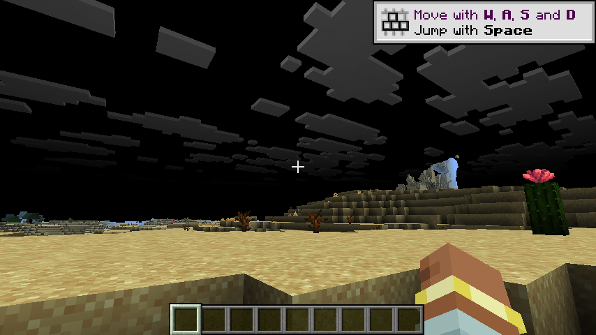

# h19 · 🔴🔖 **方向翻转**：pass 一次都没跑，闪烁**依然在** ⇒ 根因是 **M-01 管线替换**，不是我们的 pass

> 任务来源：`AGENT_CONTEXT.md` §10.24 ⑦（先解决闪烁）。
> 取证方式：① 纯静态读原版 `renderGroups`（排除候选④）；② **能一刀切开的二分**：`captureTerrainDraws=false`。
>
> 判定：🔴 **候选④排除**；🔴🔖 **GAP-011 的方向被彻底翻转** —— 此前两轮（h16/h17）的归因**都是错的**。

---

## 〇、一句话结论

把 M-05 的捕获关掉后，我方的 pass 因 `captured == null` **早退**，
`terrain drawn into` = **0**（一次都没画）—— **而闪烁与黑天依然在**。
🔖 ⇒ **闪烁与黑天都不是我方 pass 造成的**，而是 **M-01 的管线替换**（
`ChunkSectionLayer#pipeline(...)` 被换成我们的派生管线）造成的。
🔖 此前我把方向押在「我方 pass 泄漏渲染状态」上，**押错了两轮**。

---

## 一、候选④ 排除（纯静态，零客户端成本）

读原版 `net/minecraft/client/renderer/chunk/ChunkSectionsToRender.java`：

~~~java
public void renderGroup(...) {
    GpuTextureView lightmap = gameRenderer.lightmap();
    this.renderLayers(group.layers(), sampler, renderPass, atlas, lightmap, ...);
}

private void renderLayers(...) {
    RenderSystem.AutoStorageIndexBuffer autoIndices = RenderSystem.getSequentialBuffer(QUADS);
    renderPass.setUniform("TerrainUniform", this.terrainTransformUBO);
    renderPass.setUniform("Sampler0", atlas, sampler);
    renderPass.setUniform("Sampler2", lightmap, ...);
    ...render(layer, renderPass, ...);
}
~~~

🔖 **全文没有 `setShaderTexture`** —— 原版用的是 `renderPass.setUniform(...)`，那是 **pass 级绑定**，不碰全局槽 0。
⇒ **候选④排除**。我上一轮「全局槽 0 被污染」的推断**没有代码依据**，纯属推测。

🔦 **教训**：这一条本该在上一轮就用**纯静态读码**确认，我却把它当成「需要客户端验证的头号嫌疑」。
**能静态证伪的假设，先静态证伪** —— 比跑一次客户端（≈4 分钟）快两个数量级。

---

## 二、🔴🔖 决定性的二分：`captureTerrainDraws=false`

### 2.1 为什么这个二分能一刀切开

`MrtTerrainPass.drawTerrain()` 的第一条语句就是：

~~~java
Object captured = TerrainDrawCapture.current();
if (captured == null) {
    // M-05 未开启或尚未捕获 ⇒ 无从画地形。静默跳过
    return;
}
~~~

🔖 关掉捕获 ⇒ pass **完全早退**；而 `mrt.wireTerrain` 保持开启 ⇒ **M-01 的管线替换照常生效**。
于是「pass 绘制」与「管线替换」两个变量被**完全分开**。

### 2.2 实测（三项都是硬证据）

| 判据 | 值 | 含义 |
|---|---|---|
| `terrain drawn into` | **0** | 我方 pass **一次都没画** |
| `M-01] wired: layer=SOLID` | **2** | 管线替换**确实生效** |
| 6 连拍唯一画面数 | **3** | **仍然在闪** |

🔖 这张图与 h17 的那一帧**症状完全一致**：地形正常、**黑天灰云**。
🔖 而此刻我方 pass **一次都没执行**。

### 2.3 结论

~~~
闪烁、黑天  ⟹  由 M-01 的管线替换引起（不是我们的 pass）
~~~

---

## 三、🔴 GAP-011 方向翻转（这是本轮最重要的产出）

| 轮次 | 我的归因 | 状态 |
|---|---|---|
| h16 | 「主目标被每帧清黑」 | 🔴 **错**（单帧截图误读） |
| h17 | 「我方 pass 泄漏全局渲染状态」 | 🔴 **错**（pass 关闭后闪烁仍在） |
| **h19** | **「M-01 管线替换与原版不兼容」** | 🟡 **本轮结论**，机理待细化 |

🔖 **我连续两轮押错了方向，代价是四轮取证。** 根因是我一直用「症状相近」推理（黑屏↔清屏、黑天↔状态泄漏），
而没有做**能一刀切开的对照实验**。h19 这个二分（`captureTerrainDraws=false`）是**唯一**真正区分两个变量的做法，
它本该在 h16 症状出现时就做。

🔦 **新增纪律（X49）**：当有 ≥2 个候选都能解释症状时，**先设计一个「只开一个变量」的对照实验**，
而不是继续在候选上做加法（跳过 A、看 B……）。**对照实验的收益远高于逐个排除。**

---

## 四、下一步：派生管线与原版 SOLID 管线的**状态差异**

🔖 已知 M-01 把 `ChunkSectionLayer#pipeline(...)` 的返回值换成了派生管线，
由原版拿着它去画**地形**（以及其它调用该方法的对象）。
现在需要逐项对比它与**原版 SOLID 管线**的状态差异：

| 状态项 | 为什么可疑 |
|---|---|
| **color attachments 数** | 派生是多附件；原版单附件被当成多附件用 ⇒ **后面那几帧黑** |
| **depth format** | `D32_FLOAT` 与原版不一致 ⇒ depth test 行为改变 |
| **depth write / test** | 若 depth test 打开而 clear 缺失 ⇒ **天空被深度挡住 ⇒ 黑天** |
| **blend / cull** | 与原版不一致 ⇒ 地形表现异常 |

🔖 「多附件管线被拿到只有 1 个 color attachment 的 pass 里用」**正好能解释闪烁**：
那种用法在 Vulkan 上是**未定义/校验失败**，表现就是**时好时坏**。

🔖 **而黑天**可由「depth test 打开 + depth 未清」解释：地形先画，把 depth 写坏，
随后天空被 depth test 剔除 ⇒ 只剩黑。

⚠️ 以上**都是待验证的机理**，不是结论。验证方式是**纯静态读管线构建代码 + 与原版 `RenderPipelines` 对比**。

---

## 五、净结果

| 项 | 状态 |
|---|---|
| 候选④ `renderGroup` 全局绑定 | ❌ **排除**（原版用 pass 级 `setUniform`，无 `setShaderTexture`） |
| h16 / h17 的归因 | 🔴 **两轮都错**，已纠正 |
| GAP-011 方向 | 🔖 **从「pass 泄漏状态」翻转为「M-01 管线替换」** |
| 新立 X49 | 🔦 有 ≥2 候选时**先做单变量对照实验**，别逐个排除 |
| 下一步 | 派生管线 vs 原版 SOLID 管线的**状态逐项对比** |
| 测试 | ✅ **699** 单测全绿（本轮未改产品代码） |

---

## 六、稳定（支柱②）

| 判据 | 值 |
|---|---|
| `resourceLoad/ERROR` | 12（GAP-010，已独立记录） |
| `Render thread/ERROR` | 2（**均与 vkdisp 无关**：Narrator、SoundSystem） |
| `Couldn't parse GLSL` | **0** |
| 客户端崩溃 | 无 |
| 残留游戏进程 | **0** |
| 配置复原 | ✅ 总闸 `enabled=false`，`mrt.*` 全关 |

⚠️ 仍**不**声称「0 validation error」（本机无 Vulkan validation layer —— 而这恰恰是本轮最需要的验证层）。

---

## 七、测试

本轮**未改产品代码**（纯定位 + 静态读码）。`./gradlew build` ⇒ **699** 单测全绿。

---

## 八、本轮**没有**证明的

1. ⛔ **「M-01 管线替换是根因」是本轮结论，但机理未验证**（四类状态差异都是待查项）。
2. ⛔ **全黑相位为何连地形都没有**，仍未解释（多附件管线误用的假设**未验证**）。
3. ⛔ GAP-008 仍未判定；GAP-007 / GAP-009 未动；M-04 仍需用户裁决。

---

## 九、下一轮入口（用户要求：先解决闪烁）

1. **纯静态对比派生管线与原版 `RenderPipelines` 的 SOLID 管线**：
   color attachments / depth format / depth test+write / blend / cull，逐项列出差异。
2. 若确认「多附件管线被单附件 pass 使用」⇒ 修法是**给 M-01 加一道守卫**：
   原版调用上下文只有 1 个 color attachment 时**回退到原版管线**，并自报回落次数。
   这同时能消掉闪烁。
3. **GAP-010 并行**（用户可见的 12 条 ERROR）。

---

## 十、产物与哈希

| 文件 | sha256 |
|---|---|
| `evidence/h19-images/h19-S-terrain-ok-sky-black-passoff.png`（**pass 未执行时的症状**，决定性） | `47c44f46cae8e3ab6afc8236f6f6a835d02c4e5ee35a63dced618223eb90adae` |
| `evidence/h19-images/h19-R-black-phase.png`（全黑相位） | `45172103d6cf2eaeb06fc816d714accd605f54b03edc3bf6bf48973594ba05cd` |
| `run/logs/latest.log` | `641199e27be811ca4fac975045564900949621311cbd392d59d3dcb9745cef33` |

收尾 `game_procs.sh kill` → 残留 0；配置已复原为默认。
