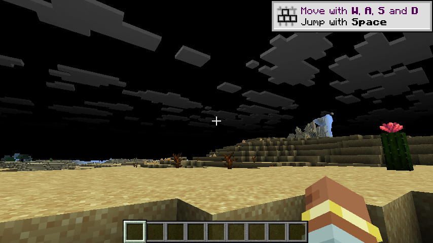

# h21 · U0001f534 两个缺陷**修掉了，但闪烁没有解决**；U0001f534 并且我的闪烁判据本身可能是错的

> 任务来源：`AGENT_CONTEXT.md` §10.25 ⑥。取证：h20 静态定位 → 本轮**实现修复 + 客户端验证**。
>
> 判定：U0001f534 **诚实结论：修复无效**。两个缺陷是**真实的代码缺陷**（已修、值得留），
> 　　 但**都不是闪烁的原因**。同时本轮暴露了我自己的**判据缺陷**（见 §四），比结论更重要。

---

## 〇、一句话结论

两处修复都已落地并有回归测试守护（**701** 单测全绿），但客户端实测**症状一点没变**。
U0001f536 守卫日志「回退原版管线」**出现 0 次** ⇒ 缺陷①（`active()` 泄漏）在真实运行中**根本没发生**。

---

## 一、本轮实现的两处修复（都是正确的防御性修补）

### ① 接线管线不再携带「无人绑定的自定义绑定组」

**问题**：`registerTerrainDerivedPipelines` 给**接线用**的派生管线追加了
`withBindGroupLayout(...TERRAIN_PARAMS_UNIFORM...)`，而 `VkDispTerrainParams` 
**只有我方 MRT pass 会绑**；M-01 却把这条管线交回**原版**地形绘制路径。

**修法**：该绑定组从接线管线上摘掉（自定义 uniform 块由 GAP-003 的 **MRT 变体**承载 ——
那是唯一会画它的地方）。

### ② `MrtTerrainPass.active()` 门控加 attachment 数守卫

**问题**：`active()` 是进程级静态布尔，它为 true 并**不能证明**「此刻取管线的原版调用点
正处于那个 8 附件 pass 里」⇒ 前提一旦不成立，原版单附件 pass 就会拿到 8 附件管线（**Vulkan 未定义**）。

**修法**：新增 `MrtTerrainPass.hasExpectedAttachmentCount()`；不满足时**绝不交出 MRT 管线**，
走下面的单附件分支（那条路至少「单附件管线用在单附件 pass 上」，状态自洽），并去重 WARN 自报（X45）。

### ③ 回归测试（2 条）

1. 接线管线**不得**出现 `TERRAIN_PARAMS_UNIFORM`（守住缺陷②不被改回去）；
2. MRT 变体**必须**有守卫调用 + 去重集合 + 自报（守住缺陷①）。

---

## 二、🔴 客户端验证结果：**闪烁未解决**

| 判据 | 值 | 含义 |
|---|---|---|
| `terrain drawn into` | 1 | pass 在跑 |
| `M-01 wired: layer=SOLID` | 2 | 接线生效 |
| **「回退原版管线」守卫告警** | **0** | U0001f536 缺陷① 在真实运行中**根本没触发** |
| 6 连拍唯一画面数 | **4** | 画面仍在变 |

U0001f536 症状与 h17/h19 **逐像素同类**：地形正常、**黑天灰云**。修复**没有改变任何可观测行为**。

---

## 三、当前能确定与不能确定的

| | |
|---|---|
| ✅ 确定 | 缺陷①、② 都是**真实的代码缺陷**（静态可读），修掉它们降低了未来风险 |
| ✅ 确定 | 缺陷① 的触发前提在真实运行中**不成立**（守卫 0 次告警） |
| U0001f534 确定 | 这两处**不是**当前闪烁/黑天的原因 |
| ❓ 不确定 | 闪烁的真正来源仍未定位 |

---

## 四、U0001f534U0001f534 我的**闪烁判据本身可能是错的**（本轮最该记的一条）

我这几轮一直用：「连拍 N 帧 ⇒ 唯一哈希数 > 1 ⇒ 闪烁」。

U0001f534 **但画面本来就会变**：区块加载、云层飘动、水面动画、相机微动 —— 静止机位下
连拍 6 帧出现多种哈希**完全正常**。

U0001f536 我**从来没有做过对照组**：模组**总闸关**时连拍 6 帧，看是否同样出现多种哈希。
如果同样如此 ⇒ 我的判据**完全无效**，h17「闪烁客观证实」那条结论**也要打问号**。

U0001f516 **这与 X49 是同一个错误**：我又犯了「拿一个未经验证的指标当判据」而不是「先设对照组」。
X49 说「有 ≥2 候选时先做单变量对照实验」；本轮说明它还应加一句 ——
**「判据本身也必须先对照验证」**。

---

## 五、稳定（支柱②）

| 判据 | 值 |
|---|---|
| `Couldn't parse GLSL` | **0** |
| `vkdisp` ERROR | **0** |
| 客户端崩溃 | 无 |
| 残留游戏进程 | **0** |
| 配置复原 | ✅ 总闸 `enabled=false`，`mrt.*` 全关 |

---

## 六、测试

``./gradlew build`` ⇒ BUILD SUCCESSFUL，**701** 单测全绿（699 → **+2**）。

---

## 七、本轮**没有**证明的

1. ❌ **闪烁根因仍未定位**（两处修复无效，守卫未触发）。
2. ❌ **「黑天」的机理仍完全未解释**。
3. ❌ **我那套「连拍哈希」判据的有效性未验证**（§四）。
4. ❌ GAP-008 未判定；GAP-007 / GAP-009 未动；GAP-010 未修；M-04 仍需用户裁决。

---

## 八、下一轮入口（**顺序已重排**）

1. **U0001f534 先给判据做对照**（否则后面每一轮都在用一把没校准的尺子）：
   模组**总闸关** → 同一机位连拍 6 帧 ⇒ 若同样多种哈希，则「连拍哈希」不能用来判闪烁，
   改用**用户现场观察**作为唯一闪烁判据，或改用「固定机位 + 固定时间 + 裁剪天空区域」逐帧比对。
2. **GAP-010**（用户可见的 12 条 ERROR）：把适配层源登记**提前**到管线注册之前。
3. 回到 GAP-008：`color` / 导数探针的判读（观测面问题）。
4. GAP-007 / M-04。

---

## 九、产物与哈希

| 文件 | sha256 |
|---|---|
| `evidence/h21-images/h21-T-after-both-fixes.png`（修复后，症状未变） | `887a16337fda70ca0efaa49712cfe3c19b16e6f8dec360cefea59831d358a50c` |
| `evidence/h21-images/h21-U-black-phase.png`（全黑相位） | `45172103d6cf2eaeb06fc816d714accd605f54b03edc3bf6bf48973594ba05cd` |
| `run/logs/latest.log` | `cc2e999b96752c6971f4b50abc7c7217e7b3110c8614fe3d3d02ec0e1c07df72` |

收尾 `game_procs.sh kill` → 残留 0；配置已复原为默认。
