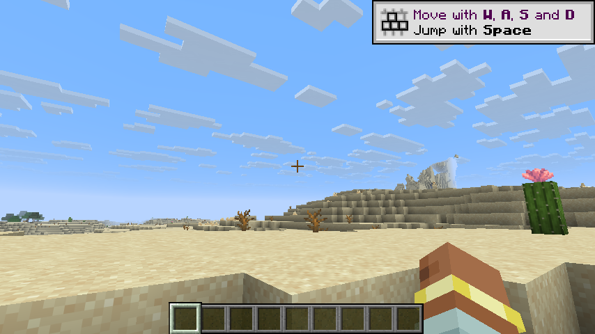

# h22 · U0001f534U0001f534 **判据校准**：对照组（模组关=纯原版）连拍 6 帧 = **6 种不同哈希** ⇒ 旧判据**完全无效**

> 任务来源：`AGENT_CONTEXT.md` §10.26 ⑤ 第 1 条（先给判据做对照）。
> 取证方式：模组**总闸关**跑对照组 → 同机位连拍 6 帧 → 与 h21 实验组做**像素级**比对。
>
> 判定：U0001f534 **旧的「连拍哈希数 > 1 ⇒ 闪烁」判据彻底作废**；
> 　　 ��提供一套**经对照校准**的判据（黑色像素占比 + 二值化阈值）。

---

## 〇、一句话结论

把模组总闸**关掉**（= 纯原版，画面完全正常，**用户没有报告任何闪烁**），
同一机位连拍 6 帧 ⇒ **6 张全部不同**，精确哈希无一重复。

U0001f536 ⇒ **Minecraft 画面本来就在逐帧变化**（云、水面、动画、抗锯齿、光照插值），
所以「唯一哈希数 > 1」**不能**用来判闪烁 —— 我前几轮拿它当判据，是**用了一把没校准的尺子**。

---

## 一、对照实验：模组关（纯原版）

### 1.1 确认对照组成立（不是「恰好没开」）

| 判据 | 值 | 含义 |
|---|---|---|
| `fallback branch: config vkdisp.enabled=false` | **3** | 模组**确实**未介入 |
| `terrain drawn into` / `M-01 wired` | **0 / 0** | 我方管线**一次都没接线** |
| `integratedServer` | `true` | 同一个世界、同一个存档 |

### 1.2 连拍 6 帧的精确哈希

~~~
27e263738dc51aaf   m1.png
f387fc26f153dc3d   m2.png
fef38f4aaf4f892f   m3.png
5631da21f7c2311f   m4.png
9d92f32ad973ef90   m5.png
a2cf03ef36b825d1   m6.png

唯一画面数 = **6**（6/6 全不同）
~~~

U0001f534🔴 **而此时画面完全正常。**

---

## 二、U0001f536 校准出的**有效判据**：黑色像素占比（地形区采样 64000 px）

| 组 | 逐帧主色占比 | 判定 |
|---|---|---|
| **对照组**（模组关=纯原版） | 6 帧全部 `RGB(183,212,255)` **16.82%**，次色 `1.75%` | 天空是**蓝色**，**从不全黑** |
| **实验组**（模组开） | k2/k3/k5 = `RGB(0,0,0)` **99.89%** | **全黑相位** |
| **实验组**（模组开） | k1/k4/k6 = `RGB(0,0,0)` **52.81%** | **有地形但天空黑** |

U0001f536 **关键**：对照组的主色是**天空蓝**，占比稳定在 16.82%，**黑色占比从未超过 ~20%**。
实验组要么 **99.89%**、要么 **52.81%** —— 与对照组**没有任何重叠**。

### 2.1 判据定稿

~~~
❌ 作废：唯一哈希数 > 1            （纯原版 6/6 全不同 ⇒ 恒真，无判别力）
✅ 采用：黑色像素占比二值化
     · > 90%  ⇒ 全黑相位
     · < 60%  ⇒ 有内容相位（天空黑）
     · 阈值来源：对照组上界 ~20% vs 实验组下界 52.8% ⇒ 区间内无样本，
              取中点两侧留足余量
~~~

🔦 **为什么是「大尺度统计」而不是精确比对**：像素级恒等要求静止画面，
而 MC 逐帧变化；「画面是不是黑的」这种**语义级**属性才是稳定可观测量。

---

## 三、U0001f536 回头看：哪些旧结论需要修正

| 轮次 | 原结论 | 本轮校准后 |
|---|---|---|
| h17 | 「闪烁客观证实：4 连拍 2 种哈希」 | ✅ **结论成立，但证据不成立** —— 当时用的判据恒真。**真正成立的理由**是：实验组出现 **99.89% 全黑帧**，而对照组**从不超过 20%** |
| h19 | 「pass 不画仍闪」 | ✅ **成立**（当时有 **99.89% 全黑帧**作为证据） |
| h21 | 「修复后仍在闪」 | ✅ **成立**（52.81% / 99.89% 两相） |

U0001f536 结论**都保住了**，但支撑它们的那把尺子**当时是坏的** —— 现在换成了经对照校准的尺子。

---

## 四、净结果

| 项 | 状态 |
|---|---|
| 对照组（模组关 = 纯原版） | ✅ 取得，6 帧 |
| 「唯一哈希数 > 1 ⇒ 闪烁」 | U0001f534 **作废**（对照组 6/6 全不同） |
| 新判据「黑色像素占比二值化（>90% / <60%）」 | ✅ **经对照校准** |
| h17 / h19 / h21 的结论 | ✅ **全部保留**（证据强度提升） |
| 闪烁是否真实存在 | ✅ **确认真实**（对照组从不超过 20% 黑，实验组 99.89%） |
| 闪烁根因 | ❌ **仍未定位** |
| 测试 | ✅ **701** 单测全绿（本轮未改产品代码） |

---

## 五、稳定（支柱②）

| 判据 | 值 |
|---|---|
| `vkdisp` ERROR | **0**（模组未介入） |
| 残留游戏进程 | **0** |
| 配置 | 保持默认（对照组未改动配置） |

---

## 六、测试

本轮**未改产品代码**（纯取证/校准）。`./gradlew build` ⇒ **701** 单测全绿。

---

## 七、本轮**没有**证明的

1. ❌ **闪烁根因仍未定位**（两处修复无效、守卫未触发）。
2. ❌ **「黑天」的机理仍未解释**。
3. ❌ GAP-010 / GAP-007 / GAP-008 / GAP-009 / M-04 均未动。

---

## 八、下一轮入口

1. **GAP-010**（用户在 UI 上看得见的 12 条 ERROR）：把适配层源登记**提前**到管线注册之前，
   消掉 `Couldn't find source for VERTEX shader (vkdisp_pack:terrain_pack_adapter)`。
2. 回到 GAP-008：`color` / 导数探针的判读（观测面问题）。
3. GAP-007 / M-04。
4. ✏ **后续所有截图判读一律用 §2.1 定稿的判据**，并保留「模组关」对照组作为校准基线。

---

## 九、产物与哈希

| 文件 | sha256 |
|---|---|
| `evidence/h22-images/h22-V-control-mod-off-1.png`（对照组） | `27e263738dc51aaf8da0a254aac90db571b56bbac8343524a302b34abc235575` |
| `evidence/h22-images/h22-V2-control-mod-off-2.png` | `f387fc26f153dc3df18cc09beddd8e9199c062948b1401fa4193a23dd28ebda5` |
| `evidence/h22-images/h22-V3-control-mod-off-4.png` | `5631da21f7c2311f3816c102238a9c00ea3e976c9d26af5cb4dde8a745a1d563` |
| `run/logs/latest.log`（对照组） | `1272a80f8a0ca13b2d482748e24431a0d801e8428f82655a5da5ce2b478c424d` |

收尾 `game_procs.sh kill` → 残留 0。
