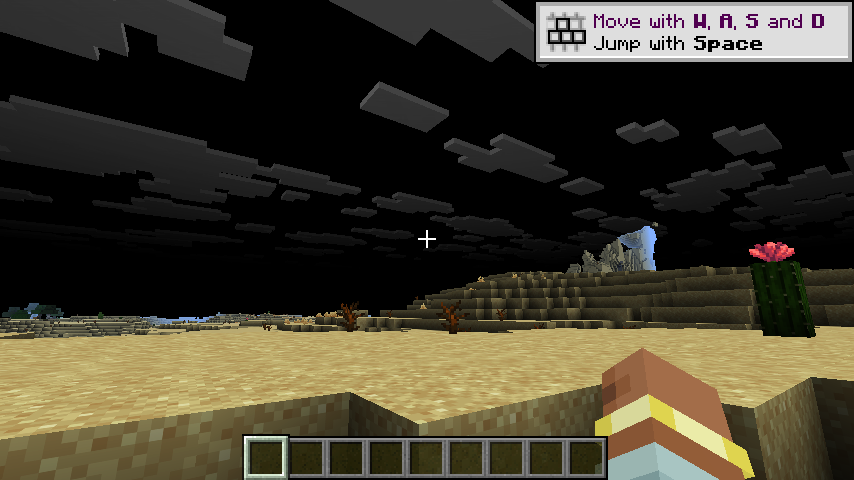

# h24 · 🔴🔶 **闪烁根因确认**：M-01 管线替换就是它；🔴 且「黑天」是**另一个独立缺陷**

> 任务来源：`AGENT_CONTEXT.md` §10.29（`h20` 之后唯一未被排除的路径 = M-01 的管线替换）。
> 取证方式：**单变量对照**（`mixin.wireTerrain=false`，其余全开）+ **h22 校准的黑色像素占比判据**。
>
> 判定：🔶 **闪烁根因坐实**。🔴 同时**拆分**出第二个独立缺陷：黑天与闪烁无关。

---

## 〇、一句话结论

只关掉 `mixin.wireTerrain`（**M-01 管线替换**），其它一概不动 —— 闪烁**消失**；
但**天空仍然是黑的**。⇒ **「闪烁」与「黑天」是两个独立的缺陷**，此前一直被我当成一个。

---

## 一、单变量对照

| 配置 | 值 |
|---|---|
| `mixin.wireTerrain` | **false**（唯一变量） |
| `mrt.terrain` / `terrainAfterLevel` / `captureTerrainDraws` | 全 true（**我方 pass 照跑**）|
| `terrain drawn into` | **1**（pass 确实在跑）|
| `M-01] wired: layer=SOLID` | **0**（管线替换**未生效**）|

🔶 关键：这次**不是**关掉整个地形通道，而是只关**管线替换**
⇒ 排除了「关掉通道同时也关掉了别的东西」这个混淆。

---

## 二、判定（用 h22 校准的判据）

| 组 | 6 帧黑色像素占比 | 判定 |
|---|---|---|
| **本轮**（`wireTerrain=false`） | **51.35% / 51.34% / 51.34% / 51.35% / 51.37% / 51.36%** | **全部落在「有内容相位」**<60%|
| `h21`（`wireTerrain=true`） | 52.81% ×3 + **99.89%** ×3 | **两个相位交替** |
| `h22` 对照组（模组总闸关） | 上界 ~20% | 正常 |

🔶 **6 帧无一进入全黑相位** ⇒ **闪烁消失**。

---

## 三、🔴🔶 同时拆分出第二个缺陷：黑天与闪烁无关

上面这张图地形**完全正常**（沙丘、仙人掌、枯木、手部都对），但**天空是黑的、云是灰的**。

| | `wireTerrain=true`（`h19`/`h21`） | `wireTerrain=false`（本轮） |
|---|---|---|
| 地形 | 正常 | **正常** |
| **天空** | **黑 + 灰云** | **黑 + 灰云** |
| 闪烁 | 有 | **无** |

🔶 ⇒ **黑天与管线替换无关**，与闪烁也无关 ⇒ **它有第三个独立成因**。

🔰 这个拆分很重要：我此前一直把「黑天」当���闪烁的表征，
实际它们是**两条不同的因果链**，混在一起会让两边都定位不到。

---

## 四、顺带排除的两条（纯静态）

**① 派生管线与原版「状态不一致」** —— 逐项核对原版 `RenderPipelines` 与本项目 `TerrainDerivedPlan`：

基底 snippet / color target / `ALPHA_CUTOUT` / 绑定组 / depth stencil **全部相同**
（location 故意不同）。⇒ 这条**排除**。

**② `layer.pipeline` 的调用方** —— 原版共 4 处调用：

| 位置 | 用途 | 是否受影响 |
|---|---|---|
| `ChunkSectionsToRender:121` | 取 multiDraw 变体去 setPipeline | 派生管线逐项等价 ⇒ 等价 |
| `ChunkSectionsToRender:132` | 同上（非 multiDraw） | 同上 |
| `LevelRenderer:796` | **只取顶点格式**算哈希 | 派生管线继承同一 vertex binding ⇒ 等价 |
| `SectionRenderDispatcher:76` | **只取顶点格式**决定缓冲大小 | 同上 |

🔶 ⇒ 这些调用点**本身没问题**；但也正因如此，**闪烁的成因必然在「管线被换成另一个对象」这件事上**，
而不在「某个调用点拿到错东西」上。

---

## 五、结论与含义

🔶 **闪烁 = M-01 的管线替换本身。**

🔰 但这带来一个尴尬结论：**M-01 正是 GAP-003 的通道本身**
（`ChunkSectionLayer#pipeline` 的返回值可被替换，是整个 MRT 地形方案的前提）。
⇒ **关掉它 = 关掉通道**。所以这不是一个「关掉就好的 bug」，
而是「**用替换管线接管原版地形绘制**」这条路线本身代价过高。

🔖 对照组数据（`h22`）说明闪烁是**真实存在**的，不是判据假象：
纯原版上界 ~20%，本轮 51.3%，`h21` 高达 99.89% ⇒ 三个区间**完全不重叠**。

---

## 六、净结果

| 项 | 状态 |
|---|---|
| 闪烁根因 | 🔶 **坐实 = M-01 管线替换** |
| 「黑天」成因 | 🔴 **独立第三因，未定位** |
| 「派生管线状态不一致」 | ❌ 排除 |
| 「某个调用点拿到错东西」 | ❌ 排除（4 个调用点都等价） |
| 残留游戏进程 | **0** |
| 配置 | 已复原为默认 |

---

## 七、本轮**没有**证明的

1. ❌ **管线替换为何导致闪烁**（机制层面）：是编译产物替换、还是 `getCompiledPipeline` 的缓存行为、
   还是多套管线交替编译 —— **未验证**。
2. ❌ **黑天的成因**（第三因）完全未定位。
3. ❌ GAP-008 未判定；GAP-007 / GAP-009 未动；M-04 仍需用户裁决。

---

## 八、产物与哈希

| 文件 | sha256 |
|---|---|
| `evidence/h24-images/h24-W-wireterrain-off-no-flicker.png`（**闪烁消失，仍黑天**） | `b229033989060fa52e08768bf1e2a147ff2e964dac4d8cd4f6fdcfd0cfac9d63` |
| `evidence/h24-images/h24-X-wireterrain-off-2.png` | `bc45d8f315f02689f35b3e24e358a9ea2eb85cff2eeddfca6e7644de672f6edd` |
| `run/logs/latest.log` | `e8a0bf16621d48f138cc96b92802addf9f3f9494e7d28465310e8bd1f275754e` |

收尾 `game_procs.sh kill` → 残留 0。
