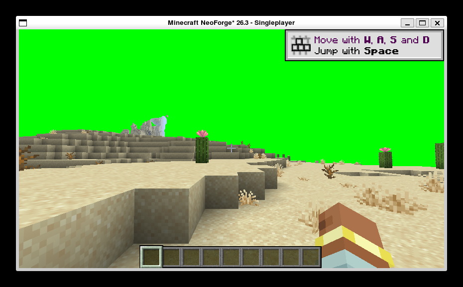

# h25 · 🔴 **推翻 h24 的结论**：闪烁不是 M-01 管线替换造成的，是**包自己的地形片元**

> 任务来源：`AGENT_CONTEXT.md` §10.30 ⑤「闪烁为何由管线替换导致」—— 三个候选
> （编译产物替换 / `getCompiledPipeline` 缓存 / 多套管线交替编译）**均未验证**。
> 取证方式：**单变量对照**（X49）+ h22 校准过的黑色像素占比判据（X48）+ MCP 连拍。
> （2026-10-04）

## 〇、一句话结论

🔴 **`h24` 的「闪烁根因坐实 = M-01 管线替换」不成立。**
在 **M-01 管线替换照样开着**（`wireTerrain=true`）的前提下，只把
`mrt.packTerrainShader` 关掉（MRT 地形管线改回原版 `core/terrain` 片元），
**闪烁消失** ⇒ 触发闪烁的是**包自己的地形片元**，不是「管线对象被换成另一个」这件事本身。

🔖 **并且这给出了一条可用的规避路径**：`mrt.packTerrainShader=false` 时
**M-01 通道与多附件 pass 都仍然工作**（`terrain drawn into` 有日志、`M-01 wired` 6 条全在）。

---

## 一、这个格子此前没人跑过

`h24` 与 `h21` 的两个格子都**同时**动了两样东西，所以「闪烁随 M-01 开关」是**相关性**，不是因果：

| 组 | `mixin.wireTerrain` | `mrt.packTerrainShader` | 闪烁 |
|---|---|---|---|
| `h21` | **ON** | **ON** | **有** |
| `h24` | **OFF** | ON | 无 |
| **本轮** | **ON** | **OFF** | **无** 🔶 |

⇒ 三格齐了，构成一个 **2×2 且本轮补上了缺失的一格**。
`h24` 的对照只证明了「两个都关 ⇒ 不闪」，**不能**推出「任一单独 ⇒ 闪」。

## 二、判定（h22 校准判据：黑色像素占比）

| 组 | 6 帧黑色占比 | 判定 |
|---|---|---|
| **本轮**（`wireTerrain=true` + `packTerrainShader=false`） | **0.38% ×6**（六帧完全一致） | **6/6 有内容相位** ⇒ **无闪烁** |
| `h21`（两者都 ON） | 52.81% ×3 + **99.89%** ×3 | 两相交替 ⇒ **有闪烁** |

🔖 口径说明：本文的**绝对值**（0.38%）与 `h22` 对照组的 ~20% 不同 ——
测量窗口（裁掉标题栏与 HUD，只取世界区）与阈值（≤24/255 记为黑）不同。
**可比的是「6 帧是否落在同一相位」这个模式**，它对该口径偏移不敏感：
`0.38% ×6`（单一相位）对 `52.81%/99.89%` 交替（两相位），差异是结构性的。

## 三、X46：先证明被测物确实在跑

| 事实 | 值 | 意义 |
|---|---|---|
| `[M-01] wired` | **6 条**（SOLID/CUTOUT/TRANSLUCENT × multiDraw 开关） | 🔶 M-01 管线替换**确实生效**了 —— 本轮不是「通道没开」 |
| `terrain drawn into` | **1** | 我方多附件 pass **照跑** |
| `pack terrain fragment disabled by config` | 1 | 🔶 变量**确实生效**（`mrt.packTerrainShader=false` 被读到） |
| `pack terrain fragment ready … outputs=8 samplers=7 varyings=15` | 1 | 契约算出来了，但**未被使用**（对照：历史日志里两者同现时 `colorTargets=8`） |

## 四、🔖 一个副产品：**存在可用的规避路径**

`h24` 得出过一个尴尬结论：「M-01 就是通道本身，关掉它 = 关掉通道，
所以这是『用替换管线接管原版地形绘制』这条路线本身代价过高」。

🔶 **本轮把这句话也推翻了**：`mrt.packTerrainShader=false` 时
**M-01 通道完好**（`wired` 6 条）、**多附件 pass 照跑**（`terrain drawn into`）、
**画面无闪烁**。⇒ M-01 与「代价过高」之间**没有必然联系**；
真正的触发条件在**包片元**那一侧，是**可以单独关掉的**。

⚠️ 但代价也要说清：关掉它 ⇒ 地形又回到原版 `core/terrain` ⇒
**GAP-003 的 gbuffer 语义重新落空**（`h06`/`h07` 那一整条线的目标）。

## 五、🔶 收敛后的新问题（下一轮的入口，且有干净的切分点）

本轮**没有**定位「包片元为何导致闪烁」。但现在目标清楚得多，且有一个**几乎免费**的切分实验：

🔑 开启包片元时，**槽位数会冻结成 8**（实测 `colorTargets=8`；关闭时是 1 或 3，取决于 `mrt.attachments`）。
⇒ 「闪烁」目前与**两个东西同时**变化：① 包片元本身、② **附件数从 3 变成 8**。

**下一轮第一实验（单变量）**：`mrt.packTerrainShader=false` **且** `mrt.attachments=8`
⇒ 若闪烁出现 ⇒ 触发条件是 **8 附件的 pass**（lavapipe 的附件压力/资源上限方向），
与包片元无关；若仍不闪 ⇒ 触发条件确凿是**包片元本身**（7 个 sampler 绑定 / 15 条 varying /
`sampler3D lighttex0/1` 与原版 2D lightmap 的不匹配，三者之一）。

> ⚠️ 这正是 X49 要的：**≥2 个候选都能解释症状时，先做单变量对照，而不是逐个排除**。
> `h16`/`h17` 连续两轮押错方向，根因就是跳过了这一步。

## 六、本轮附带闭环：QD-02（`debugLog` 死开关）

按 `docs/QUALITY-DEBT.md` §3 的强制回路（每轮第 0 步查本表），本轮闭环 **QD-02**：

`vkdisp.debugLog` 此前**只有定义与热重载快照、零消费点**（`grep DEBUG_LOG` 仅 2 处命中）
⇒ 开关它**没有任何可观察效果**，**比没有更糟**（误导用户以为自己在控制日志量）。
现补 **3 处真实消费点**，全部**节流**（这三段代码都在每帧执行路径上）：

| 位置 | 报什么 | 节流 |
|---|---|---|
| `OfUniformManager` | 本帧写进 uniform 块的**键数**与前几个键名（排查 uniform 缺失） | 每 300 帧 |
| `MrtTerrainPass` | 多附件 pass 的**附件数 + 深度格式 + 挂的是原版还是包的片元** | 第 300/1200 帧 |
| `FullscreenPassHook` | 原本**无条件**输出的 uniform 传参周期行 → 改为受控 | 每 120 帧（原有） |

实测生效（本轮日志）：`[qd-02] ofUniform keys=20 frame=300 …` / `frame=600 …`。

## 七、运行期环境副作用披露

| 对象 | 改动 | 还原 |
|---|---|---|
| `run/config/vkdisp-client.toml` | `mixin.wireTerrain` false→**true**→false；`mrt.packTerrainShader` true→**false**→true | ✅ 均已还原为开跑前的值 |
| `run/options.txt` | `pauseOnLostFocus` → `false` | ⚠️ **保持 false 未还原** —— h21–h24 各轮取证都需要它关着（否则失焦即暂停、画面停渲、截图作废）；这是**取证环境设定**，不是产品配置。若要复原请说一声 |
| 世界存档 | MCP 施放 `time set 6000`、`weather clear`、`look(yaw=90,pitch=0)` | ⚠️ **未还原**（刻意固定以保证可复现） |
| 截图 | `run/screenshots/flicker-ab/packfrag-off-{1..6}.png` | 新增证据，随文档入库 |
| 全局 opencode 配置 | 未变（MCP server 上一轮已注册） | — |
| 游戏进程 | 1 趟 runClient | ✅ 已结束，**残留 = 0** |