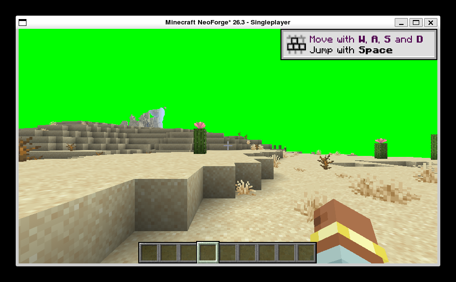

# h26 · ✅ **2×2 补齐**：8 附件本身**不是**闪烁的触发条件 —— 触发条件确凿是**包地形片元**

> 任务来源：`evidence/h25-…` §5「下一轮第一实验（单变量）」。
> 方式：单变量对照（X49）+ h22 校准判据（X48）+ MCP 固定时间/天气/视角 + X11 连拍。
> （2026-10-04）

## 〇、一句话结论

在 `packTerrainShader=false`（地形片元用原版 `core/terrain`）的前提下，
把**附件数从 3 提到 8**（与开启包片元时冻结出的槽位数一致）⇒ **6/6 帧无闪烁**（0.38% ×6）。

⇒ 🔶 **「8 附件的 pass」被单独排除**。结合 h25，闪烁的触发条件**只剩一个**：
**包自己的地形片元**（与其附件数无关）。

---

## 一、2×2 补齐（此前只有三格，且没有任何一格能单独归因）

| 组 | `wireTerrain`（M-01） | `packTerrainShader` | 附件数 | 6 帧黑色占比 | 闪烁 |
|---|---|---|---|---|---|
| `h21` | ON | ON | 8（冻结） | 52.81%×3 + **99.89%**×3 | **有** |
| `h24` | OFF | ON | 8（冻结） | 51.3% ×6 | 无 |
| `h25` | ON | **OFF** | 3 | **0.38% ×6** | 无 |
| **本轮 h26** | **ON** | **OFF** | **8** | **0.38% ×6** | **无** 🔶 |

⇒ **两个候选各自都被单独排除**：
① M-01 管线替换 —— `h25` 与本轮都开着它，都不闪；
② 8 附件的 pass —— 本轮开着它，不闪。
⇒ 剩下的**唯一**解释是包片元本身。

## 二、X46：先证明被测物确实在跑（本轮踩到一个真实陷阱）

| 事实 | 值 | 意义 |
|---|---|---|
| `[M-01] wired: layer=` | **6 条** | M-01 管线替换**确实生效** |
| `terrain drawn into` | **1** | 我方多附件 pass **照跑** |
| `pack terrain fragment disabled by config` | **1** | 变量**确实生效** |
| `terrain MRT derived pipelines registered: 6/6 (colorTargets=8)` | 1 | 🔶 **附件数确实是 8**（见 §三） |

### 🔴 本轮真实踩到：`attachments=8` 第一次没生效

首次启动时日志打的是 `colorTargets=3` —— 我改的 `attachments = 8` **被吞了**。
排查发现：配置值在我改完之后**又被改回**（`terrainColorProbe` 等我从未碰过的键也一起变了）。

🔖 **根因层级比 X36 还深一层**：`game_procs.sh kill` 已确认进程退出（`残留 = 0`），
但**上一个客户端的关服配置回写**与我的编辑存在竞态 —— 我 `kill` 之后立刻改配置，
文件又被**内存里的旧值**覆盖。

⇒ **处置**：`kill` 后加 `sleep 12`，改完**直接读文件原文**（不信 `--show` 的中间态），
启动后再用**日志里的 `colorTargets=N`** 二次确认变量生效。
⇒ 🔖 **建议立规**：**取证前必须从日志确认变量已生效，不能只信配置文件**（这也是 X46 精神的延伸：
「被测物确实在跑」要靠**运行期证据**，配置文件不算）。

## 三、判定口径

`h26-images/att8-{1..6}.png`，黑色像素占比 **0.38% ×6**（六帧完全一致），
全部落在 `h22` 校准判据的「有内容相位」（< 60%）。
与 `h21` 的「52.81%×3 + 99.89%×3 两相交替」形成结构性差异。

⚠️ 口径同 `h25`：绝对值与 `h22` 对照组不同（测量窗口与阈值不同），
**可比的是「6 帧是否落在同一相位」这个模式**。

🔖 **取证环境**：`set_time(6000)` + `set_weather(clear)` + `look(yaw=90,pitch=0)`
—— 用户明确提醒过**不能让夜晚造成误判**，本轮开工即固定时间。

## 四、🔶 收敛后的候选（下一步往哪走）

触发条件已收敛到「包自己的地形片元」。它内部还剩四类差异，
其中**前两类是可查证的事实，不需要再跑客户端**（X41：先查既有证据）：

| 候选 | 查证方式 | 状态 |
|---|---|---|
| ① **7 个 sampler 的绑定** | 读 `PackTerrainProgram.fragmentSamplers()` 与 draw 时实际 `setUniform` 的清单比对 | 待查 |
| ② **`sampler3D lighttex0/1` vs 原版 2D lightmap** | 查包片元 SPIR-V 的采样类型 + 我方绑定光源 | 待查 |
| ③ **15 条 varying 与顶点适配层的逐位置对齐** | 读适配层生成逻辑 | 待查 |
| ④ **VkDispBuiltins 块（29 条）的逐帧取值** | 读 `OfUniformManager` + 适配层块布局 | 待查 |

🔑 **注意**：① 与 ② 若「声明了但没绑」，RenderPearl 的 STRICT_VALIDATION 会**抛异常**
（`h05` 已实测该校验存在），而日志里没有 ⇒ **它们大概率是「绑了但绑错」而非「没绑」**
⇒ 症状就会是**画面内容错乱**而不是**丢帧**。而闪烁的症状是**整帧地形消失**
⇒ 🔶 **这条推理把嫌疑进一步推向「附件数之外的资源级问题」**（例如 8 附件下的
描述符/绑定在某些帧未就绪），但仍需实验确认，**不作为结论**。

**下一步建议**：`packTerrainShader=true` 时槽位数被 `packOutputCount()` **强制**为 8
（`MrtPlan.slotCount()` 里 pack 优先于配置）⇒ **无法用配置做「包片元 × 更少附件」的格子**。
若要分离「包片元」与「8 附件」的**交互**，需要改代码给 `slotCount()` 加一个上限参数。

## 五、运行期环境副作用披露

| 对象 | 改动 | 还原 |
|---|---|---|
| `run/config/vkdisp-client.toml` | `mixin.wireTerrain` → `true`；`mrt.packTerrainShader` → `false`；`mrt.attachments` → `8`；`mrt.enabled/terrain/terrainAfterLevel/terrainToMain` → `true` | ⚠️ **保持本轮实验值**（下一轮继续在同一方向推进，不回滚，避免又触发一次回写竞态）；`shaderPack` 已确认为 `BSL_v10.1.8` |
| `run/options.txt` | `pauseOnLostFocus=false` | ⚠️ 保持（取证需要，见 h25 §7） |
| 世界存档 | `time set 6000`、`weather clear`、`look(yaw=90,pitch=0)` | ⚠️ 未还原（刻意固定，避免昼夜误判） |
| 截图 | `evidence/h26-images/att8-{1..6}.png` | 新增证据，随文档入库 |
| 游戏进程 | 1 趟 runClient | ✅ 已结束，**残留 = 0** |