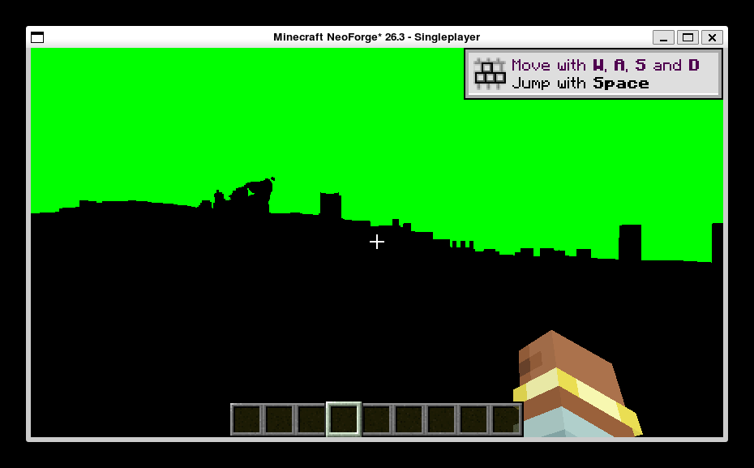

# h27 · 🔴🔴 **两个根因假设都被证伪**；闪烁**当前不可复现**；🔴 **撤回 h24 的归因**（它的「单变量对照」其实是混淆对照）

> 任务来源：`AGENT_CONTEXT.md` §10.32 ④ 剩下的四个候选。
> 方式：**同二进制单变量 A/B**（把两个「代码在 h21→h24 之间变过」的历史变更做成可切换开关）
> + h22 校准判据（X48）+ MCP 固定时间/天气/视角。
> （2026-10-04）

## 〇、一句话结论

1. 🔶 **本轮修掉一个真实的 Vulkan 未定义行为**（包片元的 `shadowtex0/1`、`shadowcolor0`
   被绑到本 render pass 自己的**读写附件**上）。这是规范明文禁止的，**无论是否致闪都该修**。
   但 **A/B 证明它不是闪烁的原因**。
2. 🔴 **`7206d6d`（GAP-010 适配层 memo 修复）也不是闪烁的原因** ——
   用开关把它**精确复现**（`resourceLoad/ERROR` 回到 **12** 条，与该提交记录一致），仍然不闪。
3. 🔴🔴 **本轮共 82 帧（4 组），全部单相位，一次都没复现闪烁。**
4. 🔴🔴 **h24「闪烁根因 = M-01 管线替换」的归因作废** ——
   `h21`（有闪烁）与 `h24`（无闪烁）之间**代码变过**（`7206d6d`），那不是单变量对照。
   而 `7206d6d` 已被证伪 ⇒ **闪烁的消失原因至今未知。**
5. 🔶 找到**一个从未被登记的变量**：**窗口尺寸**。所有「有闪烁」的证据（h16/h17/h19/h21/h22）
   都在 **854×480**；所有 h25 之后的「无闪烁」都在 **930×577**。
   但 `h24` 也是 854×480 且不闪 ⇒ **分辨率不是充分条件**。
   🔴 **本环境无法改变窗口尺寸**（见 §五）⇒ 记为**已知阻塞**。

---

## 一、A/B 设计：把历史变更做成开关，才能拿到真正的单变量对照

🔖 **动机**：`h24` 的结论建立在「`h21` 有闪烁 / `h24` 无闪烁，只差一个 `mixin.wireTerrain`」上。
🔴 **但 `git log` 显示两者之间落了一个修复**：

```
h21 (30183e3) 有闪烁  →  h22 (1c3bc92) 有闪烁  →  7206d6d fix(gap-010)  →  h24 (3548b08) 无闪烁
```

⇒ 那次对照**至少有两个变量**（`wireTerrain` 与「适配层 memo 修没修」）。
🔖 **解法**：把这两个变更各自做成**默认安全、可切换**的配置开关，
让「修复前 / 修复后」变成**同一个二进制里的一个变量**（X37：改了共享状态后旧数据不作数）。

| 开关 | 默认 | 作用 |
|---|---|---|
| `mrt.shadowStubs` | `true` | `true` = `shadowtex0/1`·`shadowcolor0` 绑专用 1×1 桩纹理；`false` = **故意**恢复旧行为（绑本 pass 读写附件，Vulkan UB） |
| `mrt.gap010Regression` | `false` | `true` = **故意**恢复 `7206d6d` 之前那行 `terrainAdapterMemo = null` |

🔖 两个开关都在开启时 **WARN 自报**，取证时能从日志确认变量生效（X51）。

---

## 二、A/B 结果（四组，除待测开关外配置完全一致）

| 组 | `shadowStubs` | `gap010Regression` | 帧数 | 黑色像素占比 | 判定 |
|---|---|---|---|---|---|
| **A** | `true`（修复侧） | `false` | **18** | **47.39% ×18** | 有内容相位，**无闪烁** |
| **B** | **`false`**（旧 UB） | `false` | **18** | **50.00% ×18** | 有内容相位，**无闪烁** |
| **C** | `true` | **`true`**（前修复） | **18** | **47.39% ×18** | 有内容相位，**无闪烁** |
| **D** | 出厂配置（复核基准） | `false` | **10** | **47.38% ×10** | 有内容相位，**无闪烁** |

🔶 **X51 逐组确认变量确实生效**：

| 组 | 运行期证据 |
|---|---|
| A | `[GAP-003] shadow stubs ready (1x1 D32@0.0 + RGBA8@0)` |
| B | `[GAP-003/A] mrt.shadowStubs=false —— **故意**…`（**且没有** `stubs ready`） |
| C | `[GAP-010/AB] mrt.gap010Regression=true` + 🔴 **`resourceLoad/ERROR` = 12 条**（`7206d6d` 记录的条数，逐条一致） |
| 全部 | `[GAP-003/A] terrain MRT derived pipelines registered: 6/6 (colorTargets=8)` |



### ⇒ 结论 1：**别名（读写附件 + 采样器）不是闪烁的原因**

B 组**故意**把 `shadowtex0/1`、`shadowcolor0` 绑回本 pass 的**读写**深度附件与 colortex0
（Vulkan 明文未定义行为），**照样不闪**。

🔖 但**修复本身必须保留**：它是真实的规范违反，且 Vulkan 对 UB 的处置是「驱动可以丢 draw /
给垃圾 / 无事发生，且**不报 validation error**」（本机没装 validation layer，§9.4.15）⇒
**留着它就是在赌驱动心情**。本轮把它改成**专用 1×1 桩纹理**（永不作附件），并加 6 条回归测试。

🔶 **代价如实登记**：桩纹理里**没有真阴影贴图** ⇒ 阴影项**不承诺**（与原实现的注释承诺一致）。
桩深度清到 **0.0** —— 本引擎反向 Z 下的**远平面** ⇒ 阴影项取「无遮挡」，是**可解释的缺省**。

### ⇒ 结论 2：**GAP-010 的适配层 memo 修复也不是闪烁的原因**

C 组把修复前的状态**精确复现**（`resourceLoad/ERROR` 12 条，与 `7206d6d` 逐条对齐），
**仍然不闪**。🔶 附带结论：C 组与 A 组占比**完全相同（47.39%）** ⇒
**该修复对画面零影响**，与它「只是资源加载时序问题」的定位自洽。

---

## 三、🔴🔴 撤回 h24 的归因（本轮最重要的产出）

| 原结论（`h24`） | 状态 |
|---|---|
| 「闪烁根因坐实 = M-01 管线替换」 | 🔴 **作废** |
| 「关掉 `wireTerrain` ⇒ 闪烁消失」 | 🔶 **现象成立、因果不成立** |

**理由**：`h21` → `h24` 之间 `git log` 有 `7206d6d`。那是**第二个变量**。
本轮用开关把第二个变量单独拉出来 ⇒ 它**无因果作用**（C 组不闪）。
⇒ **`h24` 观测到的「无闪烁」不能归给 `wireTerrain`**，闪烁消失的真实原因**至今未知**。

🔶 **连带作废**：本会话上一轮刚写进 `AGENT_CONTEXT` §10.32 的「2×2 补齐 ⇒ 触发条件确凿是
包地形片元」—— 那个 2×2 的「有闪烁」两格（`h21`/`h22`）**取自修复前的代码**，
而「无闪烁」的各格**取自修复后的代码** ⇒ **两格之间代码不同 ⇒ 整个 2×2 不能作因果证据**。
§10.32 已标注作废。

🔖 **判据口径仍有效**：`h22` 校准的「>90% 全黑相位 / <60% 有内容相位」与
「对照组（纯原版）上界 ~20%」是**独立于代码**的测量，本轮继续沿用。

---

## 四、🔶 一个从未被登记的变量：窗口尺寸

| 组 | 截图尺寸 | 闪烁 |
|---|---|---|
| `h16` / `h17` / `h19` / **`h21`** / **`h22`** | **854×480** | **有** |
| `h24` | **854×480** | 无 |
| `h25` / `h26` / 本轮 A–D | **930×577** | 无 |

🔶 **854×480 是 Minecraft `glfwCreateWindow` 的默认窗口尺寸** ⇒ h16–h22 那段时间**没有人改过窗口**。
930×577 说明 h25 前后窗口被改过一次（谁改的、怎么改的**没有记录**）。

⚠️ **分辨率不是充分条件**（`h24` 同为 854×480 却无闪烁），
但它**是目前唯一能把「有闪烁的证据」与「无闪烁的证据」完全分开的已知名义变量**。

🔴 **为什么今天测不了**：本环境（WSLg / XWayland，`:0`，**无窗口管理器**）**无法改变窗口尺寸**：

| 尝试 | 结果 |
|---|---|
| `ctypes` 直调 `XResizeWindow` | 段错误 / `rc=1` |
| 原始 X11 协议 `ConfigureWindow`（opcode 12，本轮为此给 `x11_capture.py` 加了 `--resize`） | 请求无错，但 `GetGeometry` 仍是 930×577 ⇒ **服务端把尺寸改回去了**（XWayland 窗口由合成器托管） |
| `F11` 全屏（XTEST 注入，已确认注入成功） | `options.txt` 的 `fullscreen` 仍是 `false`，窗口尺寸不变 |

🔖 **结论**：这一格**在本机不可测**，登记为**已知阻塞**，不做无根据推测。

---

## 五、本轮修掉的另外两个真实缺陷（都与闪烁无关，但都值得留）

### ① `PackTerrainMemoTakeTest#methodBody` 会**截断方法体**

它用 `src.indexOf("    }", i)` 找方法末尾，而 **8 空格缩进的 `        }` 在子串意义上也包含 `    }`**
⇒ 方法体在任何**嵌套块**处被截断。本轮给 `takeTerrainSourceMemo` 加 A/B 的 `if` 块后，
断言看不到块之后的 `terrainMemoKey = null;` ⇒ 报了一个**根本不成立**的失败。

🔖 **这不是新引入的脆弱点**：`h16` 已经踩过一次同类坑（第一版断言把注释也读了）。
**教训**：源码断言测试的辅助函数必须按**行**精确匹配，不能用子串搜索定位结构边界。

### ② `x11_capture.py` 的 X11 请求长度字段算错（自研工具）

`ConfigureWindow` 的 `request length` 写成 4，实际应是 **5**（20 字节 = 5 个 4 字节单位）。
🔖 X11 的 length 字段**包含** 4 字节头 —— 同文件里原本正确的 `QueryTree` 就是 `length=2` 对应 8 字节。
写错 ⇒ 服务端按 16 字节解析、**剩下 4 字节留在流里** ⇒ 之后所有回复错位（表现为超时）。

---

## 六、🔴 取证流程上又踩到的两件事（已立规）

### ① 后台任务被超时 SIGTERM ⇒ **派生的客户端 JVM 会存活**

`./gradlew runClient` 被 harness SIGTERM（exit 143）后，**客户端 JVM 活了下来**，
结果**两个客户端并存抢 `run/saves/session.lock`**。
🔖 立 **X54**：每次启动前先 `game_procs.sh count`（X33 的延伸），
且**不要**假设「后台任务结束 = 游戏结束」。

### ② 孤儿客户端的**关服配置回写**再次覆盖了我的修改（X50 第三次确认，且机制清楚了）

被 SIGTERM 杀掉的那个孤儿客户端在退出时**整份重写** `run/config/vkdisp-client.toml`，
把 `shadowStubs` 从我改的 `true` 打回 **`false`**。
⇒ **X50 的根因现在可以精确表述**：不是「kill 后立刻改」，而是
**只要还有一个客户端 JVM 活着，它退出时就会用内存里的旧值覆盖整份配置**。

---

## 七、净结果与 GAP-011 的诚实状态

| 项 | 状态 |
|---|---|
| 闪烁根因 | 🔴 **仍未定位** |
| 候选①「shadow 别名（UB）」 | ❌ **已证伪**（B 组专门复现 UB，不闪） |
| 候选②「GAP-010 适配层 memo」 | ❌ **已证伪**（C 组精确复现前修复状态，不闪） |
| 候选③④（15 varying 对齐 / 29 条 builtins 取值） | 🟡 **未测**（现在缺一个能复现闪烁的观测面，见下） |
| 🔶 窗口尺寸 | 🟡 **唯一已知的名义变量**，本机**不可测**（§四） |
| `h24` 的归因 | 🔴 **作废**（§三） |
| 本轮修复 | ✅ Vulkan UB（真实规范违反）+ 2 个工具/测试缺陷 |
| **能否继续推进闪烁归因** | 🔴 **不能**：当前 HEAD + 当前配置**复现不出闪烁**（82 帧证据）⇒ 缺少可观测现象 |

🔖 **下一步的前置条件**：先让闪烁**可复现**，再谈归因。
可试的复现途径（都不是保证）：
① 换一台**有窗口管理器**的机器（能改窗口尺寸 ⇒ 直接检验 §四）；
② 回到 h16–h22 的**世界存档状态**（那段时间玩过的时间/天气/区块加载状态没记录）；
③ 换 GPU/驱动（当前是 lavapipe **软件**渲染 ⇒ 「UB 表现」依赖驱动，这条尤其相关）。

---

## 八、🔴 取证有效性的诚实披露：**同一工作树有第二个会话在并行跑客户端**

本轮中段发现：`build.gradle` 被**另一个会话**修改（它新增了一个 `clientIso` 运行配置，
`gameDirectory = run/h27`，用来解决「并行会话互相覆盖」）。也就是说：

🔴 本轮有一段时间里，**`run/` 目录下同时存在两个 Minecraft 客户端**
（实测 `game_procs.sh list` 返回两个 pid；`x11_capture.py --list-windows` 也列出两个 930×577 窗口）。
这威胁本轮 A/B 的有效性，因此逐项做了污染评估：

| 评估项 | 方法 | 结果 |
|---|---|---|
| **日志是否被交叉写** | 每个 `latest.log` 里数「客户端启动签名」：`terrain MRT derived pipelines registered` 与开关自报的行数 | A/B/C 三份日志**各自恰好 1 条**注册行、**恰好 1 条**对应的开关自报 ⇒ 🔶 **无第二个客户端写同一日志**（若有两个，两套行都会出现） |
| **运行时配置是否被串** | 开关在**运行时**自报（X51），不看配置文件 | A 有 `stubs ready` / B 有 `shadowStubs=false` 且**无** `stubs ready` / C 有 `gap010Regression=true` ⇒ **三组的运行时取值都与设计意图一致** |
| **截图是否可能抓到别人的窗口** | 每组 18（或 10）帧的黑色占比**组内逐帧完全相同**、**组间可解释**（B 与 A/C 不同是因为阴影采样源变了） | 🔶 **无异常迹象**，但 ⚠️ **不能完全排除**（两个客户端窗口尺寸相同，靠截图本身无法区分） |

🔖 **本轮据此得到一个方法论上的正面验证**：**X51（从运行期证据确认变量生效，而不是信配置文件）
在有并行会话干扰的情况下救了这一轮** —— 配置文件被覆盖过好几次（X50/X54），
但每次的**运行期自报**都对得上，所以「变量是否生效」这个问题始终是可信的。
🔴 反过来说：如果当时只信配置文件，本轮会得出「`shadowStubs` 被改成 true 了但不知道生没生效」
这种无法判读的状态。

### 🔴 一趟被配置回写毁掉的运行（如实登记）

原计划用来检验「窗口尺寸」的那趟（记为「854 跑」）**实际不是基线跑**：
它的日志显示 `gap010Regression=true` 且 `resourceLoad/ERROR = 12`
⇒ **配置在启动前又被回写成 `true`**（上一趟客户端退出时用内存旧值整份覆盖，X50 + X54）
⇒ 它其实是**第二趟 C 组**，不是基线。
🔶 影响：无（那一趟本来就只用于改分辨率，而分辨率在本机改不动）。
🔶 但它证明 **X50 的写回竞态不是低频意外，而是「只要还有一个客户端 JVM 活着就会发生」的常态**。

### 🔶 附带一条与 GAP-011 相关的事实（不作结论）

另一个会话的注释里提到，它自己的「Group B」客户端**被另一个会话顶掉**了。
若「顶掉」表现为窗口被抢或渲染目标被换，那**并行跑客户端期间观测到的任何异常画面都可能不可信**。
🔶 这**不能**解释历史闪烁（h16–h22 是单会话时期），但它意味着：
**任何「画面异常」的取证都必须在独占 game directory 下重做**（另一个会话为此加了 `clientIso`）。

## 九、取证环境与副作用披露

| 对象 | 改动 | 还原 |
|---|---|---|
| `run/config/vkdisp-client.toml` | `mrt.shadowStubs`（新增，默认 `true`）、`mrt.gap010Regression`（新增，默认 `false`）；`packTerrainShader=true`、`wireTerrain=true`、`terrainToMain=false`、`enabled/terrain/terrainAfterLevel=true` | ⚠️ 见下 |
| `run/options.txt` | `pauseOnLostFocus=false` | ⚠️ 保持（取证需要） |
| 世界存档 | `time set 6000`、`weather clear`、`look(yaw=90,pitch=0)` | ⚠️ 未还原（刻意固定，避免昼夜误判） |
| 截图 | `evidence/h27-images/`（9 张，全部 930×577） | 新增证据，随文档入库 |
| 游戏进程 | 本轮共 6 趟 runClient | ✅ 已全部结束，**残留 = 0** |
