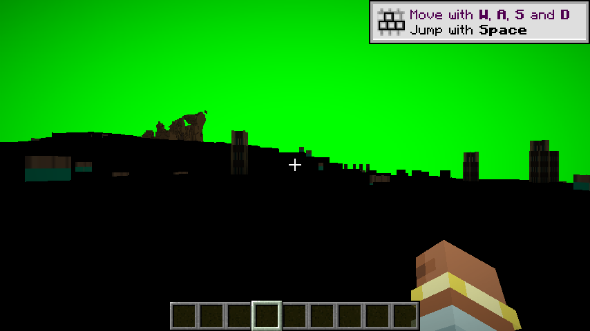
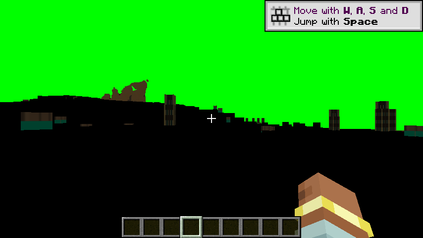

# h28 · ✅ **`color` 被排除**：顶点适配层把 `color` 强制成 `vec4(1.0)`，地形 albedo **仍恰好为 0**

> 任务来源：`evidence/h16-color-probe-and-flicker-rootfinding.md` §七 第 3 条
> ——「回到 GAP-008：用诊断视图重跑 `color` 与导数探针的判读」。
> 🔖 **h16 当年读不出结果**，理由写在它 §六 1：「探针已生效，但观测面被闪烁污染」。
> ⇒ 本轮能开跑的前提是 **GAP-011 闪烁已不复现**（`d434045` 82 帧 + `h27b` 12 帧），
> 这正好是「修好一个阻塞、才轮得到下一个」的典型次序。
>
> 方式：单变量对照（X49）+ X51 逐臂从日志确认 + h16 §四 的三道闸
> + `viewSlot` 诊断视图（h16 §七 2 定的取证面）+ 新增量化工具。
> 取证环境 `set_time(6000)` + `set_weather(clear)` + `look(yaw=90,pitch=0)`；隔离车道 `run/h27`。

---

## 〇、一句话结论

在 `viewSlot=0`（= albedo 槽）的诊断视图下，**57,218 个地形像素在两臂里都恰好是 `RGB(0,0,0)`**
（`maxR = 0`、非黑像素 `0.000%`）；把顶点适配层的 `color` 强制成 `vec4(1.0)` 后**一个像素都没变**。

🔶 ⇒ **`color` 被排除**：`albedo ≡ 0` 与 `color` 无关。
这**关闭了 `h16` 明确登记为「未判定」的那一项**（`h15` 点名的「唯一没被实验触及的因子」）。

---

## 一、两臂配置（严格单变量）

| 项 | 对照臂 | 探针臂 |
|---|---|---|
| `mrt.terrainColorProbe` | `false` | **`true`** ← 唯一差异 |
| `mrt.viewSlot` | `0` | `0`（**观测面不变**） |
| `mrt.enabled`（诊断视图） | `true` | `true` |
| `mrt.packTerrainShader` / `shadowStubs` / `wireTerrain` | `true` / `true` / `true` | 同左 |
| BSL 选项覆盖 | `SHARPEN=3` + `ADVANCED_MATERIALS=true` | 同左 |

🔖 **观测面固定在 `viewSlot=0` 是本轮的关键设计**：若两臂各用不同槽位，
就分不清「albedo 变了」与「换了个槽看」。

## 二、X51：逐臂从日志确认（不采信配置文件）

两臂日志里都有：

```
[GAP-003] MRT terrain pipelines will use pack fragment: program=world0/gbuffers_terrain colorTargets=8 samplers=7 varyings=15
[GAP-003] shadow stubs ready (1x1 D32@0.0 + RGBA8@0) …           ← 桩纹理在位
[GAP-003/A] terrain drawn into 8 attachment(s) pass (… draws=1)
pack compile done: stages=190 ok=190 failed=0
```

**唯一不同的那一行**（适配层自报，`PackVertexAdapterGenerator` 打印）：

| 臂 | 自报行 |
|---|---|
| 对照 | `顶点适配层已生成：varyings=15（常量供值 7 条：mat, recolor, normal, binormal, tangent, vTexCoord, vTexCoordAM） lmCoord=满光照诊断开关=关 dist=视差跳过诊断开关=关 color=强制白诊断开关=**关**` |
| 探针 | 同上，但结尾 `color=强制白诊断开关=**已开启**` |

🔶 这就是 h16 §四 说的「**探针确实生效了**」的第二道闸，本轮两臂都过。

## 三、🔴 为什么这个探针**值得信**（先排除「探针被覆盖」这一类假阴性）

`color` 在包自己的顶点着色器里是 `color = gl_Color;`（`program/gbuffers_terrain.glsl:553`）。
若那段代码在探针赋值**之后**执行，就会把 `vec4(1.0)` 覆盖回去 ⇒ 探针形同没开。

静态核对结论：**不存在这个覆盖风险**，因为**包的地形顶点着色器根本没有被执行**：

- `TerrainPipelineApi.java:218` → `builder.withVertexShader(TERRAIN_PACK_ADAPTER_ID)`
  ⇒ 派生管线的顶点着色器是**我们生成的适配层**（`vkdisp:terrain_pack_adapter`），
  包的 `gbuffers_terrain.vsh` 只是被用来**推导 varying 契约**，不参与执行；
- 适配层里 `color` 的赋值点唯一：`PackVertexAdapterGenerator.java:167-168`
  `colorProbe ? "color = vec4(1.0)" : "color = vkdispAdapterColor"`。

🔖 附带事实（同一处推出，**本轮未验证**）：包的 VSH `main()` 不跑 ⇒
`gl_TextureMatrix` 折叠、`waving.glsl` 草浪、`WORLD_CURVATURE` 等**顶点侧逻辑一律不生效**，
这与日志里 `mat / recolor / normal / binormal / tangent / vTexCoord / vTexCoordAM`
**7 条 varying 只能按常量供值**（登记为 GAP-007）完全一致。

## 四、测量与结果

工具：`evidence/tools/terrain_stats.py`（新增，入库）。
采样矩形 **x∈[0, 0.50] / y∈[0.55, 0.83]**，共 **57,218 px**，**逐像素**统计。

| 臂 | 帧 | luma | meanRGB | maxR | 非黑像素 |
|---|---|---:|---|---:|---:|
| 对照（`color` 取顶点属性） | 1 / 2 / 3 | `0.0000` | `(0, 0, 0)` | **0** | `0.000%` |
| 探针（`color = vec4(1.0)`） | 1 / 2 / 3 | `0.0000` | `(0, 0, 0)` | **0** | `0.000%` |





🔖 **`maxR = 0` 很重要**：不是「极暗但有纹理」，而是**每一个像素恰好 0**。
`h22` 的判据（黑色像素占比）在这里**分不出**这两种情况 —— 它只数「黑像素」，
所以本轮另写了均值型工具（见 §六 的踩坑）。

## 五、判读

按 `h16` §83 写死的判据：

> 判据：画面变亮 ⇒ `color.rgb` 本来就是 0（根因坐实）；仍全黑 ⇒ **排除**。

实测**仍全黑**，且是**逐像素恰好 0** ⇒ **`color` 排除**。

🔶 因此 h15 §⑥ 的推断「`若 color.rgb 为 0 ⇒ albedo 恒为 0`」**不成立**：
`color` 乘数即便恒为 1，`albedo` 仍然是 0 ⇒ **乘数不是那个 0 的来源**。

## 六、🔴 本轮踩到的测量坑（值得单列）

第一版 `terrain_stats.py` 取 `y∈[45%,80%]`，**混进了纯绿天空**
⇒ 报出 `mean_G ≈ 23`、`maxR = 255`、`非黑像素 15.45%` —— 一个**看起来很显著**的假信号
（纯绿 `(0,255,0)` 的 luma ≈ 182，会把均值整体抬高）。

🔖 若当时直接拿这组数字下结论，就会得出「探针让地形亮了一点」的错误结论。

处置：先打 **8×6 平均 luma 网格**读出地平线（在本机位下位于第 2/3 行之间）与 HUD 位置，
再把采样矩形收缩到**纯地形**带，并把网格图钉进工具注释。
🔖 **教训**：判「某个通道是不是 0」时，**采样区必须先证明不含其它内容** ——
纯色清屏（这里是诊断绿）是最容易污染均值的来源。

## 七、🔶 一个**未解释**的异常（不影响结论，如实登记）

两臂的**天空区**不一样：对照臂绿色天空中有暗色云状物，探针臂是**纯绿**（luma 恒 182.4 = `(0,255,0)`）。

- ❌ **不是探针造成的**：探针只在**地形**适配层里生效
  （`VkDispVirtualPack.generateTerrainAdapter` → `PackVertexAdapterGenerator`），
  且包的天空程序另有 `color = gl_Color;`（`gbuffers_skytextured.glsl:165`）我们并未改它。
- ⚠️ 因此**原因未知**，登记为待查（可能与云的绘制时序/两趟启动的时间差有关，未验证，不作结论）。
- 🔖 它**不影响**本轮结论：判读用的是 §四 的**纯地形带**（x≤50%、y∈[55%,83%]），
  该区域两臂逐像素都是 0。

## 八、下一步（收敛后）

`color` 排除 ⇒ `albedo ≡ 0` 只能来自**纹理采样本身**。看包源码（`ADVANCED_MATERIALS=true` 时）：

```glsl
164:  vec4 albedo = texture2D(texture, texCoord) * vec4(color.rgb, 1.0);   // 默认路径
169:  #ifdef ADVANCED_MATERIALS
170:  vec2 newCoord = vTexCoord.st * vTexCoordAM.pq + vTexCoordAM.st;      // ← 两者都是**常量供值**（GAP-007）
176:  #ifdef PARALLAX
178:      newCoord = GetParallaxCoord(texCoord, parallaxFade, surfaceDepth);
179:      albedo = texture2DGradARB(texture, newCoord, dcdx, dcdy) * vec4(color.rgb, 1.0);
180:  }
181:  #endif
```

⇒ **下一轮第一实验（二选一，按此顺序）**：

| # | 实验 | 判据 |
|---|---|---|
| **1** | **确定 `PARALLAX` 在本次构建里是否定义**（纯静态：查我方选项覆盖 + 包默认值如何进 `DefineProcessor`） | 未定义 ⇒ 第 179 行被编译掉，`albedo` 恒等于第 164 行 ⇒ **梯度分支与 `dcdx/dcdy` 全部出局**，嫌疑收缩到「`texture2D(texture, texCoord)` 返回恰好 0」 |
| **2** | **`texCoord` 探针**：仿照 `color` 探针，在适配层里把 `texCoord` 强制成一个**确定非零**的值（如 `vec2(0.5, 0.5)`，图集中心必然不透明） | 地形亮 ⇒ `texCoord` 是 0（很可能：图集 (0,0) 角恰好是全透明黑，与「恰好 0」的现象吻合）；仍黑 ⇒ 采样源/绑定问题 |

🔶 **理由**：`albedo` 恰好为 **0**（不是「很暗」）最像是**采到了图集角落的透明黑**，
而 `newCoord` 的两个输入 `vTexCoord` / `vTexCoordAM` 恰好都是我们**按常量供值**的（GAP-007）
⇒ 若 `PARALLAX` 开着，`newCoord` 由常量算出，**很可能就是 (0,0)**。
⚠️ 这是**推理，不是结论**；实验 1 先行，因为它可能直接让梯度分支出局。

## 九、产物与哈希

| 文件 | sha256（前 16 位） |
|---|---|
| `evidence/h28-images/ctrl-colorOFF-viewslot0-1.png` | `c99c303697f6278c` |
| `evidence/h28-images/ctrl-colorOFF-viewslot0-2.png` | `4cc0cfe9823dccd6` |
| `evidence/h28-images/ctrl-colorOFF-viewslot0-3.png` | `13196db5a0b1a4c2` |
| `evidence/h28-images/probe-colorON-viewslot0-1.png` | `baf80b06c679fa84` |
| `evidence/h28-images/probe-colorON-viewslot0-2.png` | `370946e6ab967fe8` |
| `evidence/h28-images/probe-colorON-viewslot0-3.png` | `8c6be02638611b01` |

复算命令（一行）：

```bash
python3 evidence/tools/terrain_stats.py evidence/h28-images/ctrl-*.png -- \
                                  evidence/h28-images/probe-*.png
```

## 十、测试与残留

- `./gradlew build` ⇒ **exit 0**；强制重跑 `test` ⇒ **712 用例 / 0 失败 / 0 错误 / 0 跳过**。
  （`--rerun-tasks` 会在 `:createMinecraftArtifacts` 上失败 —— 那是 ModDevGradle 的联网任务，
  与测试无关；因此只用它**强制 `test`**，不用它做构建门禁。）
- 本轮**未改产品代码与测试代码**（只新增两个 evidence 工具 + 证据 + 文档）。
- 游戏进程残留 = **0**（关掉了自己的隔离车道）。
- ⚠️ 隔离车道配置**有意保持在探针臂状态**（`mrt.terrainColorProbe=true`、`viewSlot=0`、`mrt.enabled=true`），
  下轮直接复用；主车道未被本轮改动。
