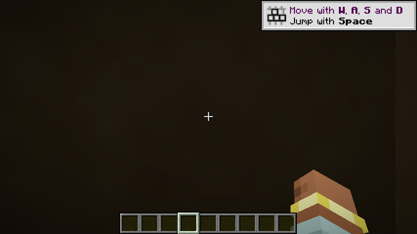

# h29 · ✅🔴 **`albedo ≡ 0` 首次正面定位**：压零项在**视差分支**（`PARALLAX`），根因接到 GAP-007/009

> 任务来源：`evidence/h28-color-probe-excluded.md` §八 第 1 条
> ——「静态确定 `PARALLAX` 是否定义；未定义 ⇒ 第 179 行被编译掉 ⇒ 梯度分支与 `dcdx/dcdy` 全部出局」。
> 方式：**零代码改动**的单变量对照（用既有选项覆盖机制）+ X51 + `viewSlot` 诊断视图 + 均值型量化。
> 隔离车道 `run/h27`；取证环境 `set_time(6000)` + `set_weather(clear)` + `look(yaw=90,pitch=0)`。

---

## 〇、一句话结论

静态：`lib/settings.glsl:87` 是 **`#define PARALLAX`（未注释 = 开启）**，
所以 `gbuffers_terrain.glsl:179` 的 `texture2DGradARB` **确实被编译进**。

实验：只把包选项 `PARALLAX` 置 `false`（改写成 `#undef PARALLAX`），其余一律不动
⇒ 纯地形带 **57,218 px 从「逐像素恰好 0」变成「逐像素非 0」**（非黑占比 `0.000% → 100.000%`，
luma `0.0000 → 12.37 / 20.20`，色调 **R>G>B 的暖色**，与沙漠砂色相符）。

🔶 ⇒ **`albedo ≡ 0` 的压零项在视差分支内**，`h28` 排除的 `color` 与本轮排除的
「默认路径 `texture2D`」都不是它。**这是 GAP-008 第一次拿到正面定位**（此前 h12–h15 全是排除法）。

⚠️ **但这不是修好了** —— 画面**仍不正确**，见 §五。

---

## 一、静态：`PARALLAX` 默认是**开**的

`lib/settings.glsl`（包内）：

```
84: //#define SPECULAR_HIGHLIGHT_ROUGH      ← 关（注释掉）
85: //#define ALBEDO_METAL                   ← 关
87:   #define PARALLAX                       ← **开**（未注释）
88:   #define PARALLAX_DEPTH 0.25 //[0.05 …]
91:   #define PARALLAX_PORTAL
```

🔖 判据不是「行首有没有 `//`」，而是**与相邻已知选项对照**：`SPECULAR_HIGHLIGHT_ROUGH` /
`ALBEDO_METAL` 是包自己关掉的写法（注释），而 `PARALLAX` 没有 ⇒ 开启。
⇒ `gbuffers_terrain.glsl:176-181` 的 `#ifdef PARALLAX` 块**进入产物**：

```glsl
176: #ifdef PARALLAX
177: if(skipParallax < 0.5) {
178:     newCoord = GetParallaxCoord(texCoord, parallaxFade, surfaceDepth);
179:     albedo = texture2DGradARB(texture, newCoord, dcdx, dcdy) * vec4(color.rgb, 1.0);
180: }
181: #endif
```

## 二、实验设计（零代码改动）

| 项 | 对照臂（= `h28` 对照臂） | 本轮臂 |
|---|---|---|
| `BSL_v10.1.8.PARALLAX` | 未覆盖 = **开** | **`false`** ← 唯一差异 |
| `ADVANCED_MATERIALS` / `SHARPEN` | `true` / `3` | 同左 |
| `mrt.terrainColorProbe` | `false` | `false`（同左） |
| `mrt.viewSlot` / `mrt.enabled` | `0` / `true` | 同左 |
| 二进制 | 三个 class 的 sha256 指纹与 `h27b` **逐一 `sha256sum -c` 通过** | 同左 |

🔖 **为什么用选项覆盖而不是加探针**：既有机制已经能把裸 `#define X` 改写成 `#undef X`
（`OptionSourceRewriter:212-219`），而 `#undef` 在预处理里**已实现且有单测**
（`DefineProcessor:138` + `OptionDefineStyleTruthTableTest`）⇒ **不需要写任何代码**，
也避免「新增诊断段本身改变产物」这个经典风险（X45 的动机）。

## 三、X51：变量确实生效（三道闸 + 覆盖命中正证）

```
选项覆盖已改写进源: 命中 3/3 [ADVANCED_MATERIALS=true, SHARPEN=3, PARALLAX=false]   ← ✅ 3 处命中，含 PARALLAX
pack compile done: stages=190 ok=190 failed=0                                        ← ✅ #undef 没把包编译搞坏
[GAP-003/A] terrain drawn into 8 attachment(s) pass (… draws=1)                      ← ✅ pass 在跑
顶点适配层已生成：… color=强制白诊断开关=关                                          ← ✅ 探针关着（与对照臂一致）
```

🔖 没有出现 `选项覆盖 'PARALLAX' 未在任何源文件中命中声明行` 的 WARN
（`ShaderPackCompiler:203-208`）⇒ 覆盖**确实落进了源**，不是静默空转。

## 四、结果

采样：**x∈[0,50%] / y∈[55%,83%]，57,218 px，纯地形带**（不含天空、不含 HUD —— 见 `h28` §六）。

| 臂 | luma | meanRGB | maxR | 非黑像素 |
|---|---:|---|---:|---:|
| 对照（`PARALLAX` 开） | `0.0000` | `(0, 0, 0)` | **0** | `0.000%` |
| **本轮（`PARALLAX=false`）** | **`12.3702`** / **`20.2016`** | **`(15.81, 11.94, 6.51)`** / **`(26.03, 19.45, 10.47)`** | **23 / 31** | **`100.000%`** |



🔖 两个数字都要看：`maxR` 从 **0** 变 **23/31**、`非黑占比` 从 **0.000%** 变 **100.000%**
⇒ 不是「稍微亮一点」，是**每个像素都从恰好 0 变成了非 0**。
色调 `R > G > B`（暖砂色）⇒ 采样到的是**有意义的方块颜色**，不是噪声。

## 五、⚠️ **这不等于修好了**（如实登记）

本轮帧的**画面仍然不正确**：整幅是**均匀暗棕**，**地形轮廓不可辨**，
而对照臂里那层纯绿天空也消失了。

🔶 因此**不能**得出「关掉 `PARALLAX` 就好」：
本轮证明的是「**压零项在视差分支**」，**不是**「关掉它就能正确渲染」。
⚠️ 甚至「诊断视图是否仍在生效」也存疑（天空那片不再是槽 0 的清屏绿）——
**未验证，不作结论**。

## 六、🔶 机制（推理，标注为推理）

把包侧与我们侧的代码接起来看，`albedo ≡ 0` 的成因链是自洽的：

1. 我们的适配层对 `vTexCoord` / `vTexCoordAM` **只能按常量供值**（GAP-007），且给的是
   **方块图集 UV**（`PackVertexAdapterGenerator:185-188`）：
   `vTexCoord = vec4(UV0, 0.0, 0.0)`、`vTexCoordAM = vec4(UV0, 0.0, 1.0)`；
2. 包的视差函数**从 `vTexCoord.st` 起步**（`lib/surface/parallax.glsl:7`）：

   ```glsl
   7:  vec2 coord = vTexCoord.st;                                  // = UV0
   20: vec3 normalMap = ReadNormal(coord).xyz * 2.0 - 1.0;         // ← 用图集 UV 去采**材质图集**
   22: if (parallaxFade >= 1.0 || normalCheck < -1.999) return texCoord;
   26: for (...) { coord += stepDir; … }                           // 沿 stepDir 推进
   ```

3. 🔴 **错配就在这里**：`ReadNormal(coord)` 要的是**材质贴图集**（`/gbuffers/normal.png` 等，
   另一套 UV 空间、另一套尺寸），我们喂进去的却是**方块图集 UV** ⇒ 采到的是错空间的内容；
4. 于是要么走进循环把 `coord` 推进到**透明黑区域**，要么 `dcdx/dcdy` 退化
   ⇒ `texture2DGradARB(...)` 返回**恰好 0** ⇒ `albedo ≡ 0`。

🔖 **值得注意的是：这条推理我们自己的诊断文案早就写过了**
（`PackVertexAdapterGenerator:137-142` 的 `parallaxSkipProbe` 提示）：

> 「若画面亮起来 ⇒ 压零项在**视差分支**（即 GAP-007 的 `vTexCoord`/`vTexCoordAM` 常量供值）；
> 若仍黑 ⇒ 候选 3/4/5 全部否定，须换切分方向」

⇒ 本轮结果与它写的**预言一致**。🔖 教训：当年那句提示是**基于代码的推理**，
而 `h12` 真正去跑 `parallaxSkipProbe` 时读数被闪烁污染（`h16` 判为「不可判」）
⇒ **推理写对了也没用，要有干净的观测面才能兑现**。

## 六·补 🔴 **顺带查出的相邻风险：`default -> atlas` 兜底把未处理的 sampler 喂成方块图集**

静态核对 BSL 地形片元声明的 7 个 sampler 与我们 `bindPackTerrainUniforms` 的 switch：

| 包的 sampler（`gbuffers_terrain.glsl`） | 类型 | 我们的绑定 |
|---|---|---|
| `texture` → `texture_0` | `sampler2D` | ✅ 方块图集（真值） |
| `specular` | `sampler2D` | ✅ `NeutralMaterialMaps` 中性缺省 |
| `normals` | `sampler2D` | ✅ `NeutralMaterialMaps` 中性缺省 |
| `noisetex` | `sampler2D` | ⚠️ `default -> atlas` |
| **`lighttex0`** | **`sampler3D`** | ⚠️ `default -> atlas`（**2D 视图喂 3D sampler**） |
| **`lighttex1`** | **`sampler3D`** | ⚠️ `default -> atlas`（同上） |
| `colortex9` | `sampler2D` | ⚠️ `default -> atlas` |

🔴 兜底本身是善意（不认识的给个真值总比 null 好），但它**静默**：

- `lighttex0/1` 是 OF 的**体积光照贴图**（`sampler3D`），拿**2D** 方块图集视图去喂，
  在 Vulkan 里属于描述符类型不匹配 ⇒ **本机无 validation layer ⇒ 不报错**（同 `h27` 的别名问题）；
- 这正是 `h26` §四 列为「待查」的候选 ②「`sampler3D lighttex0/1` vs 原版 2D lightmap」。

⚠️ **本轮没有验证它对画面的影响**（`PARALLAX` 关掉后画面仍不正确，无法区分二者贡献）
⇒ **登记为独立待查项**，**不作为本轮结论**。
🔖 建议下一轮把兜底从 `default -> atlas` 改成**显式 WARN + 按类型给可解释缺省**
（3D 给 1×1×1 中性体、2D 给 1×1 中性图），别让「不认识」静默等于「方块图集」。

## 七、下一步（按序）

| # | 动作 | 目的 / 判据 |
|---|---|---|
| **1** | **在视差分支开着的前提下**，跑 `mrt.terrainParallaxSkipProbe`（把 `dist` 强制 1000 ⇒ `parallaxFade=1.0` ⇒ 第 22 行早退 ⇒ `newCoord = texCoord`） | 分切「`newCoord` 被推进坏」vs「`dcdx/dcdy` 退化」：亮 ⇒ 前者；仍黑 ⇒ 后者（梯度采样本身坏） |
| **2** | 同 `h27b`/`ShadowStubs` 的思路：给**材质图集类 sampler**（`normal` / `specular` / `material`）绑**专用 1×1 中性桩** | 若 `ReadNormal` 拿到已知中性值 ⇒ 第 22 行的早退条件**确定成立** ⇒ `newCoord` 恒等于 `texCoord`，从根上消掉「用图集 UV 采材质图集」的错配 |
| **3** | 🔴 **需要用户裁决（不自行决定）**：本项目**没有**包的真材质集（GAP-009），而 BSL 的 `ADVANCED_MATERIALS` 路径**依赖**它。是「按能力关掉依赖缺失素材的特性」（Iris 在缺材质集时的做法），还是「补最小材质集语义」？ | 🔴 这属于 `07` 里「发现 OF 语义与原版能力冲突、需要自行补充 ⇒ **停下来问**」的范畴；且 X27「不许为性能砍掉 pack 特性」的精神也要求**明确登记**而不是顺手关掉 |

🔶 第 3 条是**本轮留下的最重要未决项**：它决定 GAP-008/GAP-009 的收口方式，
**不是**一个可以靠继续排查自动回答的技术问题。

## 八、测试与残留

- `./gradlew build` ⇒ **exit 0**（本轮**未改产品代码与测试代码**，只加证据与文档）。
- 游戏进程残留 = **0**。
- ⚠️ 隔离车道配置**有意保留**在 `PARALLAX=false` 臂（`viewSlot=0`、`colorProbe=false`），
  下一轮从它出发；主车道未被本轮改动。

## 九、产物与哈希

| 文件 | sha256（前 16 位） |
|---|---|
| `evidence/h29-images/noparallax-1.png` | `4aa874b89d4084a2` |
| `evidence/h29-images/noparallax-2.png` | `0584793a2ff92bd2` |
| `evidence/h29-images/noparallax-3.png` | `678a0d0e24572529` |

复算命令：

```bash
python3 evidence/tools/terrain_stats.py evidence/h28-images/ctrl-*.png -- \
                                  evidence/h29-images/noparallax-*.png
```
